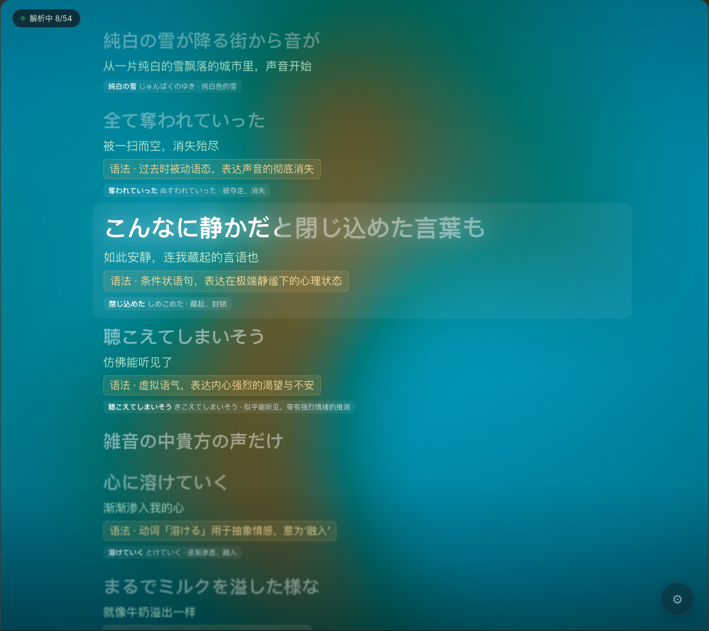

# ai-lyrics

**English** · [简体中文](./README_zh.md)

Learn a language while you listen: ai-lyrics detects the currently playing track, fetches its lyrics, shows them full-page scrolling in sync with playback, and renders AI **translation / keyword breakdown / grammar notes / examples** under each line. Click any line or drag the progress bar to seek.

It runs as a **Spicetify extension** (Spotify desktop client). The AI is pluggable — use a **local model** (LM Studio / Ollama: private, free, offline) or any **OpenAI-compatible** cloud endpoint. Both the translation target language and the UI language are configurable in settings.

> ⚠️ **Disclaimer**: This project is for personal study and research only. Spicetify works by modifying the Spotify desktop client, which may technically violate Spotify's Terms of Service — use at your own risk. Lyrics come from [LRCLIB](https://lrclib.net/) (community-contributed) and the Spotify client's own lyrics API; all rights belong to their respective owners. AI translations are machine-generated and for reference only. You are solely responsible for any consequences of using this tool.

## Screenshot



## Features

- Full-page lyrics that scroll with playback and highlight the current line; click any line or drag the progress bar to seek.
- Per-line AI **translation + keywords + grammar notes + examples**, streamed line by line, with lines near the current one prioritized.
- Analysis is cached per song (localStorage), so repeats and repeated choruses are never re-requested.
- Skips analysis when the lyrics language already matches your target language (e.g. an English song is skipped when the target is English).
- Plain (non-synced) lyrics are translated and analyzed too.
- Localized UI (follows Spotify's language, or switch manually).

## Layout (pnpm monorepo)

```
packages/
  player-core/   Pure TS: PlayerAdapter interface + Track type (track / progress / seek / events)
  lyrics-core/   Pure TS: LRC parsing, lyrics sources (LRCLIB), progress→active line, language detection, cache
  ai-core/       Pure TS: translation / keyword / grammar / example service, pluggable provider (Ollama / OpenAI-compatible)
  ui/            React components & hooks (depend only on props/hooks, no host globals)
apps/
  spicetify/     Spicetify extension: SpicetifyPlayerAdapter + route mounting + esbuild build
```

The core logic (`packages/*`) is decoupled from the host and never references `Spicetify.*` globals, which keeps it easy to test and maintain.

## Install & develop

Prerequisites: [Node.js](https://nodejs.org/) ≥ 18, [pnpm](https://pnpm.io/), and [Spicetify](https://spicetify.app/) installed and enabled.

```bash
pnpm install
pnpm --filter @ai-lyrics/spicetify apply   # build & install the extension into Spicetify, auto-refresh
```

Then, in Spotify:

- Click the captions icon in the playbar, or press **Cmd/Ctrl + Shift + L**, to toggle the lyrics page; **Esc** exits.
- Other commands: `pnpm dev` (watch build & install), `pnpm typecheck` (type check), `pnpm smoke` (headless core-logic check).

## Configure AI

Open ⚙ Settings (bottom-right of the lyrics page; click to open, long-press to force re-fetch & re-analyze the current lyrics), pick a provider and fill in:

### Local model (recommended — private + free)

- **LM Studio**: download and load a model (e.g. the MLX quant of `Qwen3-4B-Instruct-2507`), start the local server in the Developer tab, and **enable the CORS toggle**.
  - Provider: OpenAI-compatible; Base URL: `http://localhost:1234/v1`; API Key: leave empty; Model: the id shown by the server.
- **Ollama**: after `ollama pull <model>`, set the env var `OLLAMA_ORIGINS="*"` to allow cross-origin access from the browser.
  - Provider: Ollama; Base URL: `http://localhost:11434`; Model: the name you pulled.

### OpenAI-compatible cloud

Provider: OpenAI-compatible; fill in Base URL, API Key and model name. **The key is stored only in the browser (localStorage); it is never committed to the repo or sent to any third party.**

> **About CORS**: if your endpoint doesn't return `Access-Control-Allow-Origin`, the browser blocks direct calls. Use `scripts/local-proxy.mjs` to run a local forwarding proxy (see the comments in the script), or switch to a local endpoint with built-in CORS (LM Studio / Ollama).

### Local model recommendations

The task is "translate a whole song line by line + emit grammar/keyword JSON", which demands stronger **instruction-following** and **JSON stability** than plain translation. Suggestions:

| Model | Quant | Suitable machine | Trade-off |
|---|---|---|---|
| **Qwen3-4B-Instruct-2507** ⭐ | MLX 4bit | Apple Silicon 8–16GB | Balanced speed/quality, **top pick**. The Instruct variant doesn't "deep-think", avoiding a reasoning model spending a minute thinking before answering |
| Qwen3.5-4B | MLX 4bit | Apple Silicon 8–16GB | Newer generation, slightly better quality; **note** thinking is on by default and the disable-thinking toggle may not take effect in LM Studio, making it noticeably slower |
| Qwen3-1.7B / 0.6B | 4bit | Low-end / need speed | Faster and lighter, shallower explanations, good when you only want translation |
| Qwen3-8B / 14B | 4bit | 16GB+ | Better quality but slower and more memory-hungry |

Rules of thumb:

- **On Apple Silicon, prefer the MLX format** — about 20–30% faster than the same-quant GGUF.
- **Prefer the Instruct (non-thinking) variant** — reasoning/thinking models emit a long think block before the JSON, which only slows this task down.
- When loading, set **context length ≥ 8192** (to fit the whole-song context + batched JSON; 4096 may truncate).
- For more speed, enable **Speculative Decoding** in LM Studio (use 0.6B as a draft model for the 4B; JSON-shaped output has a high acceptance rate, no quality loss).
- The number of lyric lines per request (chunk size) is adjustable in settings; default is 22.

### Performance reference (measured)

> Environment: Apple M4 / 16GB / macOS 26.5; LM Studio + `qwen3-4b-instruct-2507-mlx` (MLX 4bit, context 8192); streaming, thinking disabled; chunk size 22, local serial dispatch.

**Song**: Viva La Vida — Coldplay (~4:02)　**Lyrics**: 48 lines (44 analyzable, 31 unique after dedup)

| Stage (**cold start, no cache**) | Time |
|---|---|
| Fetch lyrics (LRCLIB) | ≈ 8 s (network-dependent) |
| **First translated line appears (streamed)** | **≈ 3.5 s** |
| Full-song analysis done (44 lines: translation + grammar + keywords) | ≈ 66 s (runs in the background) |
| **Replay of the same song (cache hit)** | **≈ instant (0 requests)** |

> Notes: analysis is streamed line by line with lines near the current one first, so the **first line appears in ~3.5 s** — no need to wait for the whole song, which finishes in the background. Results are cached per song, so replays and repeated choruses aren't re-requested. A smaller model (e.g. 1.7B) or speculative decoding can shorten the full-song time further.

## Acknowledgements

Parts of this project are inspired by [**Lucid Lyrics**](https://gitlab.com/sanoojes/lucid-lyrics), an excellent Spicetify lyrics extension. We studied and borrowed its approach to full-page route mounting (registering a route via `Spicetify.Platform.History` and taking over the main view on match). Thanks to [@sanoojes](https://gitlab.com/sanoojes) and its contributors for their open-source work.

## License

[MIT](./LICENSE) © ai-lyrics contributors
